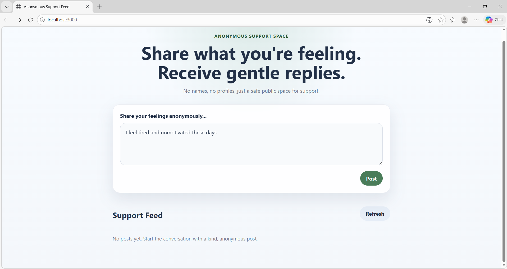
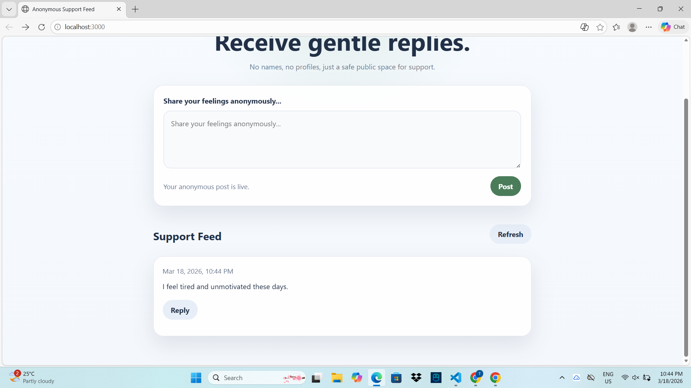
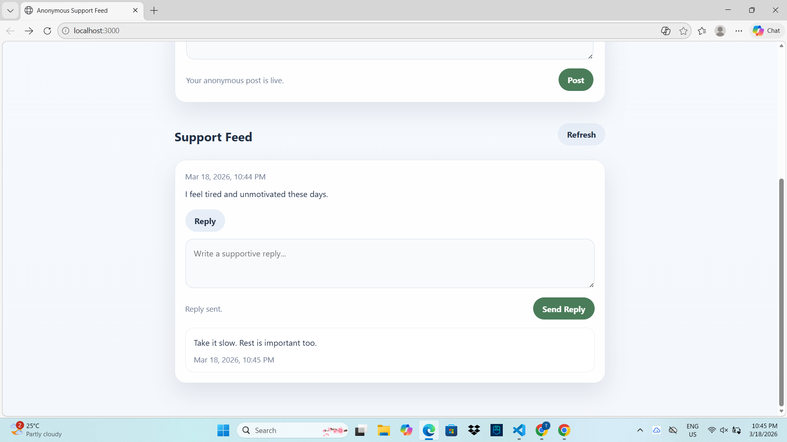

# Anonymous Emotional Support Platform

## 📌 Description

This project is a simple web application built using **Specs-Driven Development**.
It allows users to anonymously share their thoughts and receive supportive replies from others.

The system ensures privacy by not storing any user identity, creating a safe space for emotional expression.

---

## 🚀 Features

### 1. Anonymous Support Post

* Users can create and submit anonymous messages
* Posts appear in a public support feed
* Each post includes a timestamp

### 2. Supportive Replies

* Users can reply to posts with supportive messages
* Replies are displayed under the corresponding post
* All replies are anonymous

---

## 🛠️ Tech Stack

* Backend: NestJS
* Language: TypeScript
* UI: HTML + CSS (served by NestJS)
* Version Control: Git

---

## 📂 Project Structure

```
docs/
  specs/
    assignment-1-mini-spec.md

src/
  posts/
  replies/

views/
  index.html

public/
  styles.css
```

---

## ⚙️ How to Run the Project

1. Install dependencies:

```
npm install
```

2. Run the application:

```
npm run start
```

3. Open in browser:

```
http://localhost:3000
```

---

## 📸 Screenshots


* Create Post


* View Posts


* Reply to Post


---

## 📖 Notes

* This project uses **in-memory storage**, so data will reset when the server restarts.
* No user authentication is implemented to maintain anonymity.

---

## 👨‍💻 Author

Tracy Jann Wanelly C. Alcero
