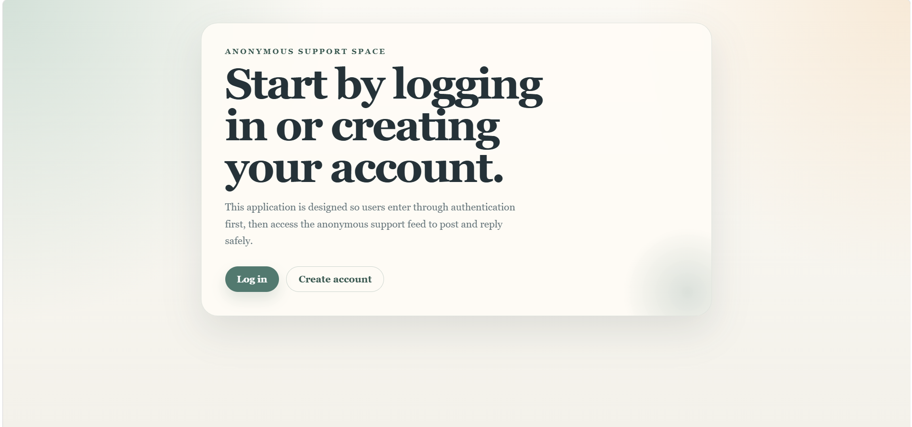
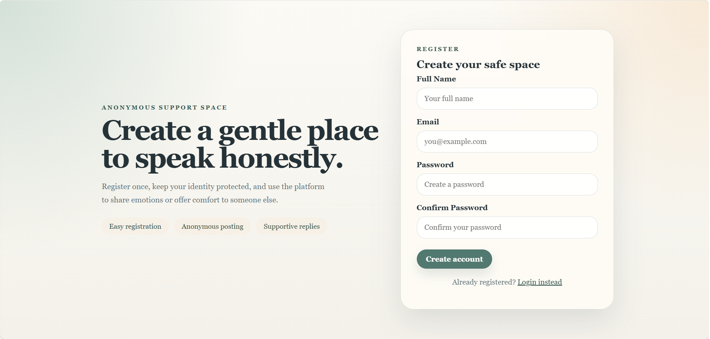
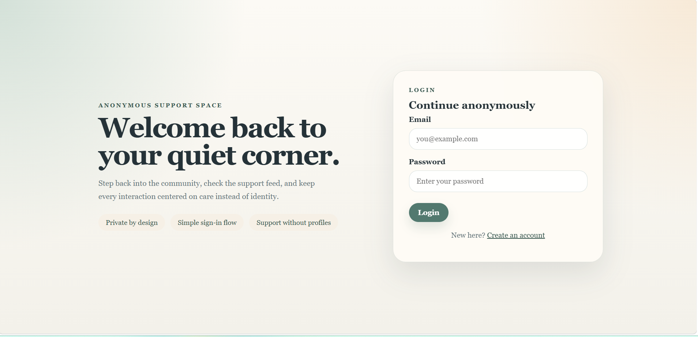
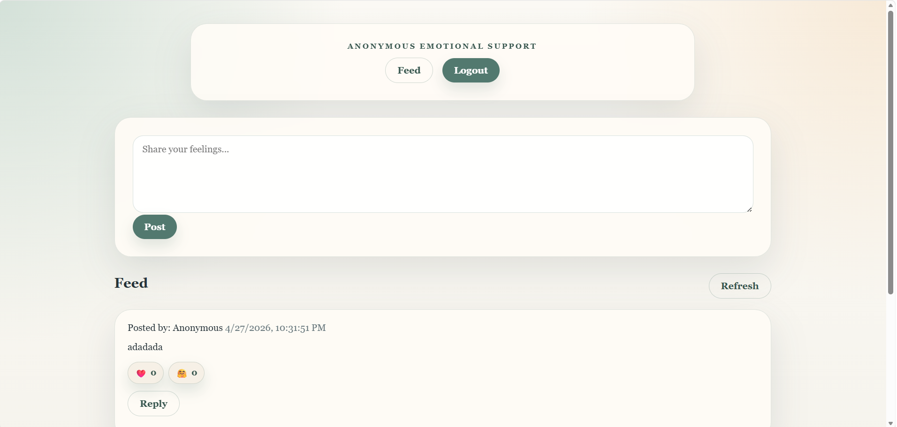

# Anonymous Emotional Support Platform

## 📌 Description

This is an anonymous emotional support web application built with **NestJS** and **TypeORM**.
Users register and log in before joining a safe, anonymous feed where they can share feelings, reply to posts, and react with support.

The user interface keeps identities hidden in the feed, while the backend uses authentication to protect access.

---

## 🚀 Features

* **Authentication**
  * User registration with name, email, password, and password confirmation
  * Login with JWT-based authentication
  * Protected dashboard and post creation endpoints
* **Anonymous Support Feed**
  * Create anonymous support posts from the dashboard
  * Display posts with timestamps but hide author identity
* **Replies & Support**
  * Reply to posts with anonymous supportive messages
  * Replies are shown under the associated post
* **Reactions**
  * Add simple reactions to posts and replies
  * Reaction counts are shown in the feed

---

## 🛠️ Tech Stack

* Backend: NestJS
* Language: TypeScript
* Database: TypeORM with MySQL (configurable via `.env`)
* Frontend: HTML + CSS served from `views/`
* Authentication: Passport + JWT

---

## 📂 Project Structure

```
src/
  auth/
  posts/
  replies/
  reactions/
  user/
  common/
  app.module.ts
views/
  dashboard.html
  index.html
  login.html
  register.html
public/
  styles.css
.env
README.md
```

---

## ⚙️ Setup & Run

1. Install dependencies:

```bash
npm install
```

2. Create or update `.env` with database settings, for example:

```env
DB_TYPE=mysql
DB_HOST=localhost
DB_PORT=3306
DB_USERNAME=root
DB_PASSWORD=
DB_DATABASE=emotional_support
DB_SYNCHRONIZE=true
JWT_SECRET=your-secret-key
```

3. Start the application:

```bash
npm run start
```

4. Open the app in your browser:

```bash
http://localhost:3000
```

---

## 📌 Notes

* The feed content is presented anonymously in the UI, even though users must authenticate to post and reply.
* Using `DB_SYNCHRONIZE=true` will sync database schema automatically; disable it in production.

---
## Screenshots

Landing Page


Registration Page


Login Page


Dashboard



---
## 👨‍💻 Author

Tracy Jann Wanelly C. Alcero
